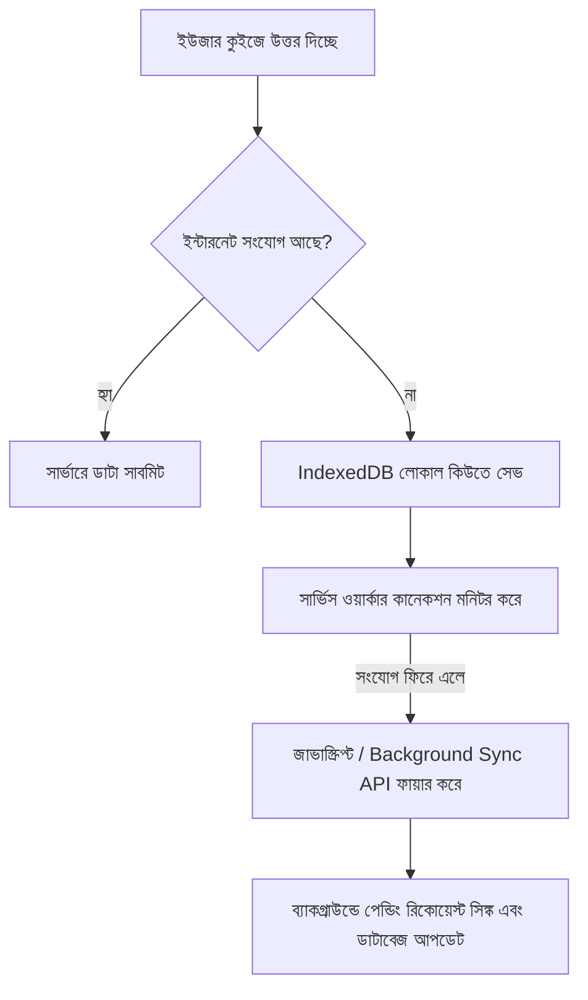

# 🔍 PwaPractice কোড অডিট ও রিমিডিয়েশন প্ল্যান (Remediation Plan)

**তারিখ:** ২৭ জুন, ২০২৬  
**অডিটর:** Senior Solution Architect & Code Auditor  

---

## সূচীপত্র
1. [সিকিউরিটি অডিট ও সমাধান (Security Audit)](#১-সিকিউরিটি-অডিট-ও-সমাধান-security-audit)
2. [স্কেলিটি ও পারফরম্যান্স এবং সমাধান (Scalability & Performance)](#২-স্কেলিটি-ও-পারফরম্যান্স-এবং-সমাধান-scalability--performance)
3. [অফলাইন ডেটা সিঙ্ক ও রিলায়বিলিটি (PWA Reliability)](#৩-অফলাইন-ডেটা-সিঙ্ক-ও-রিলায়বিলিটি-pwa-reliability)
4. [কোড আর্কিটেকচার ও বেস্ট প্র্যাকটিস (Code Architecture)](#৪-কোড-আর্কিটেকচার-ও-বেস্ট-প্র্যাকটিস-code-architecture)

---

## ১. সিকিউরিটি অডিট ও সমাধান (Security Audit)

### ক) ক্রিটিক্যাল: DOM এবং ক্লায়েন্ট-সাইড জাভাস্ক্রিপ্টে সঠিক উত্তর ফাঁস (High Risk)
* **ফাইল পাথ:** 
  * [taking.blade.php:L35](file:///c:/xampp/htdocs/Laravel-Practice/PwaPractice/resources/views/frontend/quiz/taking.blade.php#L35)
  * [taking.blade.php:L130-131](file:///c:/xampp/htdocs/Laravel-Practice/PwaPractice/resources/views/frontend/quiz/taking.blade.php#L130-L131)
* **সমস্যা:** 
  কুইজ খেলার সময় প্রতিটি প্রশ্নের সঠিক উত্তরটি HTML DOM-এর `data-correct` অ্যাট্রিবিউট হিসেবে রেন্ডার করা হচ্ছে। যেকোনো ইউজার খুব সহজেই ব্রাউজারের Inspect Element-এর মাধ্যমে বা কনসোলে গিয়ে `document.querySelectorAll('.question-container').forEach(el => console.log(el.dataset.correct))` রান করে কুইজ সাবমিট করার আগেই সঠিক উত্তর দেখে নিতে পারবে। 

#### 💡 প্রস্তাবিত সমাধান (Remediation):
HTML DOM থেকে `data-correct` সম্পূর্ণরূপে রিমুভ করতে হবে। সঠিক উত্তর যাচাই করার জন্য ক্লায়েন্ট-সাইড ভ্যালিডেশন বাদ দিয়ে সিকিউর AJAX এন্ডপয়েন্ট ব্যবহার করতে হবে।

**১. কন্ট্রোলারে ভেরিফিকেশন এন্ডপয়েন্ট তৈরি করা:**
[QuizController.php](file:///c:/xampp/htdocs/Laravel-Practice/PwaPractice/app/Http/Controllers/Frontend/QuizController.php) ফাইলে একটি নতুন মেথড যোগ করতে হবে:
```php
public function checkAnswerAjax(Request $request)
{
    $request->validate([
        'question_id' => 'required|exists:questions,id',
        'answer' => 'required|string',
    ]);

    $question = Question::findOrFail($request->question_id);
    $correctAnswers = $question->correct_answers ?? [$question->answer_text];
    
    $isCorrect = QuizScoringService::checkAnswer($request->answer, $correctAnswers);

    return response()->json([
        'correct' => $isCorrect,
    ]);
}
```

**২. ব্লেড ভিউ আপডেট ([taking.blade.php](file:///c:/xampp/htdocs/Laravel-Practice/PwaPractice/resources/views/frontend/quiz/taking.blade.php)):**
* `data-correct` কলামটি ডিভ থেকে রিমুভ করুন।
* জাভাস্ক্রিপ্টের `verify-btn` ক্লিক ইভেন্টে নিচের মতো করে AJAX কল করুন:
```javascript
verifyBtn.addEventListener('click', function() {
    if (answered) return;
    
    const userTyped = input.value.trim();
    if (!userTyped) {
        alert('Please write an answer!');
        return;
    }

    answered = true;
    stopTimer();
    input.readOnly = true;
    verifyBtn.disabled = true;

    fetch('/quiz/check-answer', {
        method: 'POST',
        headers: {
            'Content-Type': 'application/json',
            'X-CSRF-TOKEN': document.querySelector('meta[name="csrf-token"]').getAttribute('content'),
            'Accept': 'application/json'
        },
        body: JSON.stringify({ question_id: questionId, answer: userTyped })
    })
    .then(res => res.json())
    .then(data => {
        if (data.correct) {
            input.classList.add('bg-emerald-500', 'text-white');
            currentScore++;
            scoreText.textContent = `Correct: ${currentScore}`;
            showFeedback(true);
        } else {
            input.classList.add('bg-rose-500', 'text-white');
            showFeedback(false);
        }
    });
});
```

---

### খ) অ্যাডমিন ইউজার রোল সিঙ্ক লজিক্যাল বাগ (Privilege Escalation Risk)
* **ফাইল পাথ:** [UserController.php:L208-216](file:///c:/xampp/htdocs/Laravel-Practice/PwaPractice/app/Http/Controllers/Admin/UserController.php#L208-L216)
* **সমস্যা:** 
  এডমিন যখন কোনো ইউজারের প্রোফাইল এডিট করেন এবং সব রোল আনচেক করেন, তখন ডাটাবেজে রোলগুলো আপডেট হয় না। কারণ কোডটিতে `if ($request->roles)` কন্ডিশন ব্যবহার করা হয়েছে, যা খালি রোলের ক্ষেত্রে স্কিপ হয়ে যায়।

#### 💡 প্রস্তাবিত সমাধান (Remediation):
`if` কন্ডিশন সরিয়ে স্প্যাটি (Spatie)-এর ডিফল্ট এম্পটি অ্যারে হ্যান্ডেল করতে হবে:
```diff
- if ($request->roles) {
-     $user->syncRoles($request->roles);
- }
+ $user->syncRoles($request->roles ?? []);
```

---

## ২. স্কেলিটি ও পারফরম্যান্স এবং সমাধান (Scalability & Performance)

### ক) ক্যাশ ফ্লাশিং স্ট্র্যাটেজি ইমপ্রুভমেন্ট (Cache Stampede প্রতিরোধ)
* **ফাইল পাথ:** 
  * [Question.php:L23](file:///c:/xampp/htdocs/Laravel-Practice/PwaPractice/app/Models/Question.php#L23)
  * [Category.php:L19](file:///c:/xampp/htdocs/Laravel-Practice/PwaPractice/app/Models/Category.php#L19)
  * [Level.php:L23](file:///c:/xampp/htdocs/Laravel-Practice/PwaPractice/app/Models/Level.php#L23)
* **সমস্যা:** 
  একটি ডাটা সেভ বা ডিলিট হলে `Cache::flush()` করা হচ্ছে। এর ফলে পুরো অ্যাপের সব ক্যাশ মুছে যায়, যা প্রোডাকশনে হাজার হাজার শিক্ষার্থী একসাথে পরীক্ষা দিলে ডাটাবেজে মারাত্মক চাপ (Cache Stampede) তৈরি করে।

#### 💡 প্রস্তাবিত সমাধান (Remediation):
পুরো ক্যাশ ফ্লাশ না করে সুনির্দিষ্ট ক্যাশ কী ফ্লাশ করতে হবে।

**১. Category মডেল আপডেট ([Category.php](file:///c:/xampp/htdocs/Laravel-Practice/PwaPractice/app/Models/Category.php)):**
```php
protected static function booted()
{
    static::saved(function ($category) {
        Cache::forget('global_categories_all');
        Cache::forget('categories_all');
        Cache::forget('category_full_' . $category->slug);
    });
    static::deleted(function ($category) {
        Cache::forget('global_categories_all');
        Cache::forget('categories_all');
        Cache::forget('category_full_' . $category->slug);
    });
}
```

---

### খ) ডাটাবেজ ইনডেক্সিং এবং লিডারবোর্ড ক্যাশিংয়ের ঘাটতি
* **ফাইল পাথ:** 
  * [LiveExamController.php:L76](file:///c:/xampp/htdocs/Laravel-Practice/PwaPractice/app/Http/Controllers/Frontend/LiveExamController.php#L76)
  * [database/migrations/2026_03_11_081209_create_live_exam_attempts_table.php](file:///c:/xampp/htdocs/Laravel-Practice/PwaPractice/database/migrations/2026_03_11_081209_create_live_exam_attempts_table.php)
* **সমস্যা:** 
  লাইভ পরীক্ষার রেজাল্ট/লিডারবোর্ড কুয়েরিতে `orderByDesc('score')->orderBy('created_at')` মেথড সরাসরি ডাটাবেজে হিট করে। `live_exam_attempts` টেবিলে কোনো কম্পোজিট ইনডেক্স নেই, ফলে এটি মেমোরিতে Filesort করতে বাধ্য হয়।

#### 💡 প্রস্তাবিত সমাধান (Remediation):
**১. কম্পোজিট ইনডেক্স মাইগ্রেশন তৈরি করা:**
`php artisan make:migration add_performance_indices_to_live_exam_attempts` রান করে নিচের মাইগ্রেশন কোডটি যুক্ত করুন:
```php
public function up(): void
{
    Schema::table('live_exam_attempts', function (Blueprint $table) {
        $table->index(['live_exam_id', 'score', 'created_at']);
    });
}
```

**২. রেজাল্ট পেজ ক্যাশিং ইমপ্লিমেন্ট করা ([LiveExamController.php](file:///c:/xampp/htdocs/Laravel-Practice/PwaPractice/app/Http/Controllers/Frontend/LiveExamController.php)):**
পরীক্ষা চলাকালীন রেজাল্ট শর্ট-টার্ম ক্যাশ (যেমন ৩০ সেকেন্ড) এবং পরীক্ষা শেষ হয়ে গেলে আজীবনের জন্য ক্যাশ করার ব্যবস্থা:
```php
public function results(LiveExam $exam)
{
    $hasAttempted = LiveExamAttempt::where('user_id', Auth::id())->where('live_exam_id', $exam->id)->exists();

    if (! $hasAttempted && now()->isBefore($exam->end_time)) {
        return redirect()->route('live-exams.show', $exam)->with('error', 'ফলাফল দেখতে আপনাকে পরীক্ষায় অংশগ্রহণ করতে হবে...');
    }

    $page = request()->get('page', 1);
    $cacheKey = "exam_results_{$exam->id}_page_{$page}";
    
    // পরীক্ষা শেষ হলে ক্যাশ অনন্তকালের জন্য থাকবে, না হলে ৬০ সেকেন্ডের জন্য
    $ttl = now()->isAfter($exam->end_time) ? 86400 * 30 : 60;

    $attempts = Cache::remember($cacheKey, $ttl, function () use ($exam) {
        return $exam->attempts()->with('user')->orderByDesc('score')->orderBy('created_at')->paginate(50);
    });

    return view('frontend.live_exam.results', compact('exam', 'attempts', 'hasAttempted'));
}
```

---

## ৩. অফলাইন ডেটা সিঙ্ক ও রিলায়বিলিটি (PWA Reliability)

### ক) অফলাইন কুইজ এবং এক্সাম রিকভারি
* **সমস্যা:** 
  বর্তমানে অ্যাপ্লিকেশনটি নীতিগতভাবে **"Online-only"** হিসেবে ডিজাইন করা (যেমন [proper-pwa-implementation-plan.md](file:///c:/xampp/htdocs/Laravel-Practice/PwaPractice/docs/proper-pwa-implementation-plan.md) এর Phase 4-এ উল্লিখিত)। ফলে কুইজ চলাকালীন হঠাৎ নেট চলে গেলে কুইজ সাবমিট করার সাথে সাথেই ইউজারের পুরো প্রগ্রেস লস হবে।

#### 💡 প্রস্তাবিত আর্কিটেকচারাল সমাধান (Future Roadmap):
অ্যাপের অফলাইন নির্ভরযোগ্যতা বৃদ্ধির জন্য লোকাল ব্রাউজার স্টোরেজ সিঙ্ক আর্কিটেকচার স্থাপন করতে হবে।



**১. লোকাল ড্রাফট মেকানিজম (IndexedDB):**
পরীক্ষা শুরু হওয়ার পর প্রতিটি উত্তরের স্টেট ক্লায়েন্টের `IndexedDB` তে লোকাল ড্রাফট আকারে সেভ করুন।
**২. রিকানেক্ট লিসেনার:**
ব্রাউজার অনলাইন হলে স্বয়ংক্রিয় সিঙ্ক ট্রিগার করা:
```javascript
window.addEventListener('online', () => {
    // IndexedDB-তে পেন্ডিং কোনো ড্রাফট থাকলে তা লুপ চালিয়ে সার্ভারের সাবমিট এন্ডপয়েন্টে পোস্ট করা
});
```

### খ) iOS (iPhone) ডিভাইসের সীমাবদ্ধতা হ্যান্ডেল করা:
* iOS-এ প্রমিত `SyncManager` (Background Sync) কাজ করে না। তাই iOS ডিভাইসের জন্য ম্যানুয়াল সিঙ্ক এলার্ট ব্যানার ডিজাইন করতে হবে:
  * "আপনার ইন্টারনেট সংযোগ সাময়িকভাবে বিচ্ছিন্ন। সংযোগ ফিরে আসলে আপনার উত্তরগুলো স্বয়ংক্রিয়ভাবে জমা হবে, অনুগ্রহ করে উইন্ডোটি বন্ধ করবেন না।"

---

## ৪. কোড আর্কিটেকচার ও বেস্ট প্র্যাকটিস (Code Architecture)

### ক) লাইভ এক্সাম সাবমিশন রেস কন্ডিশন (Race Condition) ও অ্যাসিনক্রোনাস Evaluation ফিক্স
* **ফাইল পাথ:** [LiveExamController.php:L62](file:///c:/xampp/htdocs/Laravel-Practice/PwaPractice/app/Http/Controllers/Frontend/LiveExamController.php#L62)
* **সমস্যা:** 
  পরীক্ষা সাবমিট করার সাথে সাথেই ইউজারকে রেজাল্ট পেজে রিডাইরেক্ট করা হচ্ছে, অথচ খাতা মূল্যায়নের কাজটি জবের মাধ্যমে কিউতে (Database/Queue driver) অ্যাসিনক্রোনাসভাবে পাঠানো হয়েছে। ব্যাকগ্রাউন্ডে জব রান হওয়ার আগেই পেজ লোড হয়ে গেলে ডাটাবেজে `LiveExamAttempt` রেকর্ড খুঁজে পাওয়া যাবে না এবং ইউজার অ্যাক্সেস ডিনাইড এরর দেখবে।

#### 💡 প্রস্তাবিত সমাধান (Remediation):
কন্ট্রোলারে সাথে সাথে একটি `pending` স্ট্যাটাস দিয়ে রিমোট এটেম্পট রেকর্ড তৈরি করে দিতে হবে এবং জব প্রসেস হলে সেখানে শুধু ডাটা আপডেট করতে হবে।

**১. মাইগ্রেশন আপডেট:**
`live_exam_attempts` টেবিলে `status` কলাম (যেমন: `pending`, `evaluated`) অ্যাড করা এবং `score`Nullable করে দেওয়া।

**২. কন্ট্রোলার লেভেলে তাৎক্ষণিক রেকর্ড তৈরি ([LiveExamController.php](file:///c:/xampp/htdocs/Laravel-Practice/PwaPractice/app/Http/Controllers/Frontend/LiveExamController.php)):**
```php
public function submit(SubmitLiveExamRequest $request, LiveExam $exam)
{
    // ১. প্রথমেই রেস কন্ডিশন রুখতে ট্রানজেকশন বা ডাইরেক্ট লক দিয়ে এটেম্পট ক্রিয়েট
    $attempt = LiveExamAttempt::create([
        'user_id' => Auth::id(),
        'live_exam_id' => $exam->id,
        'status' => 'pending', // নতুন কলাম
        'score' => 0,
        'passed' => false,
        'tab_switches' => $request->input('tab_switches', 0),
    ]);

    // ২. খাতা যাচাইয়ের জন্য কিউ জবে ক্রিয়েট করা এটেম্পট অবজেক্টটি পাস করা
    ProcessLiveExamScore::dispatch($attempt, $request->answers ?? []);

    return redirect()->route('live-exams.results', $exam)->with('success', 'আপনার উত্তর সফলভাবে জমা দেওয়া হয়েছে!');
}
```

**৩. ব্যাকগ্রাউন্ড জবের ভেতর আপডেট করা ([ProcessLiveExamScore.php](file:///c:/xampp/htdocs/Laravel-Practice/PwaPractice/app/Jobs/ProcessLiveExamScore.php)):**
```php
public function handle(): void
{
    $questions = Cache::remember("exam_questions_{$this->attempt->live_exam_id}", 3600, function () {
        return $this->attempt->exam->questions;
    });

    $totalQuestions = $questions->count();
    $score = QuizScoringService::calculateScore($questions, $this->answers);
    $passed = QuizScoringService::isPassed($score, $totalQuestions);

    $this->attempt->update([
        'score' => $score,
        'passed' => $passed,
        'status' => 'evaluated'
    ]);
}
```

---

### খ) শিডিউলার থেকে অনাথ কমান্ড (Orphan Command) রিমুভ করা
* **ফাইল পাথ:** [bootstrap/app.php:L37](file:///c:/xampp/htdocs/Laravel-Practice/PwaPractice/bootstrap/app.php#L37)
* **সমস্যা:** 
  শিডিউল টাস্ক হিসেবে `$schedule->command('telescope:prune')->daily();` কল করা হয়েছে, কিন্তু প্রজেক্টে টেলিস্কোপ প্যাকেজটি ইনস্টল করা নেই। এর ফলে শিডিউলার রান হলে রানটাইম এক্সেপশন থ্রো করবে।

#### 💡 প্রস্তাবিত সমাধান (Remediation):
লাইনটি [bootstrap/app.php](file:///c:/xampp/htdocs/Laravel-Practice/PwaPractice/bootstrap/app.php) থেকে রিমুভ করুন:
```diff
- $schedule->command('telescope:prune')->daily();
```

---

## উপসংহার

অ্যাপ্লিকেশনটি লারাভেল ফ্রেমওয়ার্কের অনেকগুলো ভালো ফিচার ধারণ করলেও কুইজের সঠিক উত্তর ফাঁস হওয়া এবং লাইভ পরীক্ষা সাবমিশনের অ্যাসিনক্রোনাস রেস কন্ডিশনগুলো জরুরি ভিত্তিতে ঠিক করা প্রয়োজন। ওপরের প্রস্তাবিত সমাধানগুলো ধাপে ধাপে প্রোজেক্টে ইন্টিগ্রেট করলে অ্যাপ্লিকেশনটি উচ্চ ট্রাফিকেও অত্যন্ত নিরাপদ এবং পারফর্ম্যান্ট হয়ে উঠবে।
