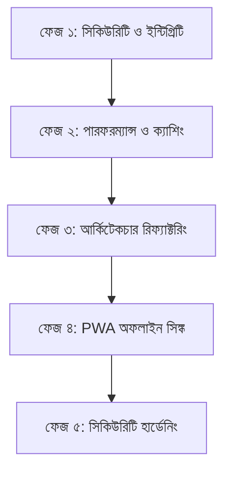

# 📋 সমন্বিত কোড অডিট ও রিমিডিয়েশন প্ল্যান (Consolidated Remediation Plan)

**তারিখ:** ২৭ জুন, ২০২৬  
**প্রজেক্ট:** PwaPractice (Laravel Quiz PWA)  
**ভূমিকা:** Senior Solution Architect & Lead Security Auditor  

---

## ১. নির্বাহী সারসংক্ষেপ (Executive Summary)

দুটি পৃথক রিভিউ রিপোর্টের (English Audit Report এবং Bangla Audit Report) গভীর অ্যানালাইসিসের পর দেখা যাচ্ছে যে, অ্যাপ্লিকেশনটির লারাভেলের বেস স্ট্রাকচার (Blade escaping, Request Validation, CSRF protection, RBAC) সন্তোষজনক। তবে অ্যাপ্লিকেশনটিকে রিয়াল-টাইম বা প্রতিযোগিতামূলক লাইভ পরীক্ষা এবং উচ্চ ট্রাফিকের উপযোগী করে গড়ে তোলার জন্য বেশ কিছু গুরুত্বপূর্ণ সিকিউরিটি ভালনারেবিলিটি, লজিক্যাল বাগ এবং পারফরম্যান্স বটলনেক দ্রুত সমাধান করা আবশ্যক। 

এই সমন্বিত প্ল্যানে মোট **১৩টি সমস্যা** চিহ্নিত করা হয়েছে এবং সেগুলোকে গুরুত্ব অনুযায়ী সাজিয়ে ধাপে ধাপে বাস্তবায়নের জন্য প্রয়োজনীয় দিকনির্দেশনা ও কোড-লেভেল সমাধান প্রদান করা হয়েছে।

---

## ২. সুনির্দিষ্ট ত্রুটিসমূহ এবং সমাধান ম্যাট্রিক্স (Detailed Findings & Remediation Matrix)

### ক) ক্রিটিক্যাল রিস্ক (Critical Severity)

#### ১. কুইজের সঠিক উত্তর ব্রাউজারে উন্মুক্ত
- **ফাইলসমূহ:** 
  - [taking.blade.php:L32](file:///c:/xampp/htdocs/Laravel-Practice/PwaPractice/resources/views/frontend/quiz/taking.blade.php#L32)
  - [taking.blade.php:L35](file:///c:/xampp/htdocs/Laravel-Practice/PwaPractice/resources/views/frontend/quiz/taking.blade.php#L35)
  - [taking.blade.php:L130](file:///c:/xampp/htdocs/Laravel-Practice/PwaPractice/resources/views/frontend/quiz/taking.blade.php#L130)
  - [taking.blade.php:L160](file:///c:/xampp/htdocs/Laravel-Practice/PwaPractice/resources/views/frontend/quiz/taking.blade.php#L160)
- **সমস্যা:** ব্লেড টেমপ্লেটে `data-correct` প্রপার্টির মাধ্যমে প্রতিটি প্রশ্নের সঠিক উত্তর ব্রাউজার DOM-এ রেন্ডার করা হচ্ছে। শিক্ষার্থীরা DevTools বা কনসোল স্ক্রিপ্ট ব্যবহার করে খুব সহজেই সাবমিট করার আগেই সঠিক উত্তর দেখে নিতে পারে।
- **প্রস্তাবিত সমাধান:** DOM থেকে `data-correct` সম্পূর্ণরূপে রিমুভ করতে হবে। জাভাস্ক্রিপ্টে ক্লায়েন্ট-সাইড ম্যাচিং বাদ দিয়ে সিকিউর AJAX POST এন্ডপয়েন্ট (যেমন: `/quiz/check-answer`) ব্যবহার করে সার্ভার-সাইড ভ্যালিডেশন চালু করতে হবে।

**কন্ট্রোলারে ভেরিফিকেশন এন্ডপয়েন্ট তৈরি করা ([QuizController.php](file:///c:/xampp/htdocs/Laravel-Practice/PwaPractice/app/Http/Controllers/Frontend/QuizController.php)):**
```php
public function checkAnswerAjax(Request $request)
{
    $request->validate([
        'question_id' => 'required|exists:questions,id',
        'answer' => 'required|string',
    ]);

    $question = Question::findOrFail($request->question_id);
    $correctAnswers = $question->correct_answers ?? [$question->answer_text];
    
    $isCorrect = QuizScoringService::checkAnswer($request->answer, $correctAnswers);

    return response()->json([
        'correct' => $isCorrect,
    ]);
}
```

---

### খ) উচ্চ ঝুঁকি (High Severity)

#### ২. লাইভ পরীক্ষা সাবমিশনে রেস কন্ডিশন ও অ্যাসিনক্রোনাস Evaluation বাগ
- **ফাইলসমূহ:** 
  - [LiveExamController.php:L57-64](file:///c:/xampp/htdocs/Laravel-Practice/PwaPractice/app/Http/Controllers/Frontend/LiveExamController.php#L57-L64)
  - [ProcessLiveExamScore.php](file:///c:/xampp/htdocs/Laravel-Practice/PwaPractice/app/Jobs/ProcessLiveExamScore.php)
  - [2026_03_11_081209_create_live_exam_attempts_table.php:L14](file:///c:/xampp/htdocs/Laravel-Practice/PwaPractice/database/migrations/2026_03_11_081209_create_live_exam_attempts_table.php#L14)
- **সমস্যা:** পরীক্ষা সাবমিটের সময় ডাটাবেজে `exists()` চেক করে কিউতে জব পাঠানো হচ্ছে। কিন্তু ডাটাবেজ টেবিলে `(live_exam_id, user_id)` এর ইউনিক ইনডেক্স না থাকায় অত্যন্ত কাছাকাছি সময়ে করা একাধিক রিকোয়েস্ট রেস কন্ডিশন তৈরি করে ডুপ্লিকেট এটেম্পট তৈরি করতে পারে। এছাড়াও জব কিউতে প্রসেস হওয়ার আগেই ইউজারকে রেজাল্ট পেজে রিডাইরেক্ট করায় এটেম্পট রেকর্ড না পেয়ে অ্যাক্সেস ডিনাইড এরর আসে।
- **প্রস্তাবিত সমাধান:** 
  1. `live_exam_attempts` টেবিলে ইউনিক কম্পোজিট ইনডেক্স যোগ করতে হবে।
  2. টেবিলে `status` কলাম (যেমন: `pending`, `evaluated`) যুক্ত করতে হবে এবং `score` কলামকে Nullable করতে হবে।
  3. কন্ট্রোলারে সাথে সাথে `status = pending` স্ট্যাটাস দিয়ে এটেম্পট রেকর্ড তৈরি করে দিতে হবে এবং জব প্রসেস হলে সেখানে ডেটা আপডেট করতে হবে।

**কন্ট্রোলার সাবমিট মেথড ([LiveExamController.php](file:///c:/xampp/htdocs/Laravel-Practice/PwaPractice/app/Http/Controllers/Frontend/LiveExamController.php)):**
```php
public function submit(SubmitLiveExamRequest $request, LiveExam $exam)
{
    // ১. রেস কন্ডিশন রুখতে ট্রানজেকশন বা ডাইরেক্ট লক দিয়ে এটেম্পট ক্রিয়েট
    $attempt = LiveExamAttempt::create([
        'user_id' => Auth::id(),
        'live_exam_id' => $exam->id,
        'status' => 'pending',
        'score' => 0,
        'passed' => false,
        'tab_switches' => $request->input('tab_switches', 0),
    ]);

    // ২. খাতা যাচাইয়ের জন্য কিউ জবে ক্রিয়েট করা এটেম্পট অবজেক্টটি পাস করা
    ProcessLiveExamScore::dispatch($attempt, $request->answers ?? []);

    return redirect()->route('live-exams.results', $exam)->with('success', 'আপনার উত্তর সফলভাবে জমা দেওয়া হয়েছে!');
}
```

---

#### ৩. অ্যান্টি-চিট (Anti-Cheat) ডেটা ক্লায়েন্ট-ট্রাস্টেড এবং সহজে টেম্পারযোগ্য
- **ফাইলসমূহ:** 
  - [taking.blade.php:L34](file:///c:/xampp/htdocs/Laravel-Practice/PwaPractice/resources/views/frontend/live_exam/taking.blade.php#L34)
  - [taking.blade.php:L311](file:///c:/xampp/htdocs/Laravel-Practice/PwaPractice/resources/views/frontend/live_exam/taking.blade.php#L311)
  - [LiveExamController.php:L62](file:///c:/xampp/htdocs/Laravel-Practice/PwaPractice/app/Http/Controllers/Frontend/LiveExamController.php#L62)
  - [SubmitLiveExamRequest.php:L25](file:///c:/xampp/htdocs/Laravel-Practice/PwaPractice/app/Http/Requests/SubmitLiveExamRequest.php#L25)
- **সমস্যা:** `tab_switches` বা ট্যাব পরিবর্তনের সংখ্যা জাভাস্ক্রিপ্ট দিয়ে পরিবর্তন করে ব্যাকএন্ডে সাবমিট করা হচ্ছে, যা কোনো ভ্যালিডেশন ছাড়াই ডেটাবেজে সরাসরি সেভ হচ্ছে। ব্যবহারকারী খুব সহজেই DevTools থেকে সাবমিট করার আগে এটি `0` করে দিতে পারে।
- **প্রস্তাবিত সমাধান:** Form Request ভ্যালিডেটরে `tab_switches` এর জন্য ইন্টিজার ও স্যানিটাইজেশন রুলস সেট করুন। ব্যাকএন্ডে এটিকে কঠোর অ্যান্টি-চিট পলিসির একমাত্র মাধ্যম না ধরে শুধু একটি নোটিফিকেশন বা সূচক হিসেবে ব্যবহার করুন।

---

#### ৪. অফলাইন কুইজ এবং এক্সাম রিকভারি অনুপস্থিত
- **ফাইলসমূহ:** 
  - [taking.blade.php:L287](file:///c:/xampp/htdocs/Laravel-Practice/PwaPractice/resources/views/frontend/live_exam/taking.blade.php#L287)
  - [sw.js:L95](file:///c:/xampp/htdocs/Laravel-Practice/PwaPractice/public/sw.js#L95)
  - [questions.blade.php:L152](file:///c:/xampp/htdocs/Laravel-Practice/PwaPractice/resources/views/frontend/questions.blade.php#L152)
- **সমস্যা:** অ্যাপ্লিকেশনটিতে বর্তমানে অফলাইন কুইজ বা এক্সাম ডেটা ড্রাফট মেকানিজম নেই। পরীক্ষা বা কুইজ চলাকালীন নেট সংযোগ বিচ্ছিন্ন হয়ে গেলে প্রগ্রেস সম্পূর্ণ হারিয়ে যায়।
- **প্রস্তাবিত সমাধান:** 
  1. ব্রাউজারের `IndexedDB` ব্যবহার করে চলমান পরীক্ষার প্রতিটি উত্তরের স্টেট লোকাল বাফার আকারে সংরক্ষণ করুন।
  2. ব্রাউজার অনলাইনে আসার পর স্বয়ংক্রিয়ভাবে ব্যাকগ্রাউন্ড সিঙ্ক চালু করতে `online` লিসেনার যুক্ত করুন।
  3. iOS ডিভাইসের Background Sync সীমাবদ্ধতার জন্য রি-কানেকশন ব্যানার ও ম্যানুয়াল সাবমিট বাটনের ব্যবস্থা করুন।

---

#### ৫. ক্যাশ ইনভ্যালিডেশন স্ট্র্যাটেজি অতিরিক্ত ব্যাপক (`Cache::flush()`)
- **ফাইলসমূহ:** 
  - [Question.php:L23](file:///c:/xampp/htdocs/Laravel-Practice/PwaPractice/app/Models/Question.php#L23)
  - [Category.php:L19](file:///c:/xampp/htdocs/Laravel-Practice/PwaPractice/app/Models/Category.php#L19)
  - [Level.php:L23](file:///c:/xampp/htdocs/Laravel-Practice/PwaPractice/app/Models/Level.php#L23)
- **সমস্যা:** যেকোনো ক্যাটাগরি, লেভেল বা প্রশ্ন সেভ বা ডিলিট হলে `Cache::flush()` করা হচ্ছে। এর ফলে সম্পূর্ণ সিস্টেমের ক্যাশ মুছে যায়, যা প্রোডাকশনে ভারী ট্রাফিকের সময় গুরুতর পারফরম্যান্স ইমপ্যাক্ট (Cache Stampede) তৈরি করে।
- **প্রস্তাবিত সমাধান:** সম্পূর্ণ ক্যাশ ফ্লাশ করার পরিবর্তে নির্দিষ্ট ক্যাশ কী বা ট্যাগ ফ্লাশ করুন।

**Category মডেল booted মেথড আপডেট উদাহরণ ([Category.php](file:///c:/xampp/htdocs/Laravel-Practice/PwaPractice/app/Models/Category.php)):**
```php
protected static function booted()
{
    static::saved(function ($category) {
        Cache::forget('global_categories_all');
        Cache::forget('categories_all');
        Cache::forget('category_full_' . $category->slug);
    });
    static::deleted(function ($category) {
        Cache::forget('global_categories_all');
        Cache::forget('categories_all');
        Cache::forget('category_full_' . $category->slug);
    });
}
```

---

### গ) মাঝারি ঝুঁকি (Medium Severity)

#### ৬. ডাটাবেজ ইনডেক্সিং এবং লিডারবোর্ড ক্যাশিংয়ের ঘাটতি
- **ফাইলসমূহ:** 
  - [LiveExamController.php:L76](file:///c:/xampp/htdocs/Laravel-Practice/PwaPractice/app/Http/Controllers/Frontend/LiveExamController.php#L76)
  - live_exam_attempts টেবিল
- **সমস্যা:** লিডারবোর্ড বা রেজাল্ট কুয়েরিতে `orderByDesc('score')->orderBy('created_at')` মেথড সরাসরি ডাটাবেজে হিট করে। টেবিলে কোনো কম্পোজিট ইনডেক্স না থাকায় ডাটাবেজ ফাইলে ফাইলসর্ট (Filesort) করতে বাধ্য হয়।
- **প্রস্তাবিত সমাধান:** 
  1. `live_exam_attempts` টেবিলে `['live_exam_id', 'score', 'created_at']` কম্পোজিট ইনডেক্স যোগ করতে নতুন মাইগ্রেশন রান করতে হবে।
  2. রেজাল্ট পেজের জন্য শর্ট-টার্ম ক্যাশ (যেমন ৩০-৬০ সেকেন্ড) এবং পরীক্ষা শেষ হয়ে গেলে আজীবনের জন্য রেজাল্ট ক্যাশ করার মেকানিজম যুক্ত করা।

---

#### ৭. কুইজ কুয়েরি প্যাটার্ন স্কেলিংয়ে ব্যয়বহুল হবে (`inRandomOrder()`)
- **ফাইলসমূহ:** 
  - [QuizController.php:L28](file:///c:/xampp/htdocs/Laravel-Practice/PwaPractice/app/Http/Controllers/Frontend/QuizController.php#L28)
  - [QuizController.php:L49](file:///c:/xampp/htdocs/Laravel-Practice/PwaPractice/app/Http/Controllers/Frontend/QuizController.php#L49)
  - [CheckLevelAccess.php:L48](file:///c:/xampp/htdocs/Laravel-Practice/PwaPractice/app/Http/Middleware/CheckLevelAccess.php#L48)
- **সমস্যা:** বড় টেবিলে র্যান্ডম অর্ডারিং (`inRandomOrder()`) অত্যন্ত ব্যয়বহুল কুয়েরি। এছাড়া সাবমিশন পেজে বারবার সম্পূর্ণ প্রশ্ন সেট ফেচ করা এবং অ্যাক্সেস মিডলওয়্যারে অতিরিক্ত লুকআপ ডাটাবেজের ওপর অপ্রয়োজনীয় চাপ তৈরি করে।
- **প্রস্তাবিত সমাধান:** র্যান্ডম প্রশ্ন সিলেকশনের জন্য সরাসরি ডাটাবেজ সর্টিং বাদ দিয়ে ক্যাশ করা প্রশ্ন আইডি পুল থেকে শাফেল (shuffle) করে র্যান্ডম আইডি নিয়ে কুয়েরি করার লজিক ব্যবহার করুন।

---

#### ৮. মডার্ন PWA-এর জন্য সিকিউরিটি হেডার অপরিপূর্ণ
- **ফাইলসমূহ:** 
  - [SecurityHeaders.php:L20](file:///c:/xampp/htdocs/Laravel-Practice/PwaPractice/app/Http/Middleware/SecurityHeaders.php#L20)
  - [master.blade.php:L22](file:///c:/xampp/htdocs/Laravel-Practice/PwaPractice/resources/views/frontend/layouts/master.blade.php#L22)
  - [master.blade.php:L103](file:///c:/xampp/htdocs/Laravel-Practice/PwaPractice/resources/views/frontend/layouts/master.blade.php#L103)
  - [master.blade.php:L467](file:///c:/xampp/htdocs/Laravel-Practice/PwaPractice/resources/views/frontend/layouts/master.blade.php#L467)
- **সমস্যা:** অ্যাপটিতে কোনো Content Security Policy (CSP) নেই এবং HSTS পলিসি চালু নেই। এছাড়া অনেক তৃতীয় পক্ষের অ্যাসেট সরাসরি এক্সটার্নাল CDN ও গিটহাবের র (raw) ইউআরএল থেকে লোড করা হচ্ছে যা সিকিউরিটি পোস্টার দুর্বল করে।
- **প্রস্তাবিত সমাধান:** কাস্টম CSP মিডলওয়্যার ইন্টিগ্রেট করুন, এক্সটার্নাল সিডিএন নির্ভরতা কমিয়ে ফন্ট ও অডিও ফাইল লোকালি হোস্ট করুন এবং প্রোডাকশনে HSTS ফোর্স করুন।

---

#### ৯. অ্যাডমিন কন্ট্রোলারগুলোতে ভ্যালিডেশন, বিজনেস লজিক ও সরাসরি এরর এক্সপোজার মিশ্রিত
- **ফাইলসমূহ:** 
  - [LiveExamController.php:L43](file:///c:/xampp/htdocs/Laravel-Practice/PwaPractice/app/Http/Controllers/Admin/LiveExamController.php#L43)
  - [LiveExamController.php:L267](file:///c:/xampp/htdocs/Laravel-Practice/PwaPractice/app/Http/Controllers/Admin/LiveExamController.php#L267)
  - [QuestionController.php:L163](file:///c:/xampp/htdocs/Laravel-Practice/PwaPractice/app/Http/Controllers/Admin/QuestionController.php#L163)
- **সমস্যা:** অ্যাডমিন প্যানেলের কন্ট্রোলারগুলোতে সরাসরি ভ্যালিডেশন, ইম্পোর্ট ফাইল হ্যান্ডলিং, এবং ডাটাবেজ রাইটিং একত্রে রাখা হয়েছে। এছাড়াও যেকোনো ব্যতিক্রম বা এররের পুরো ডিটেইল (Exception stack trace) ইউজারদের সামনে ফ্ল্যাশ করা হচ্ছে যা ইন্টারনাল সিকিউরিটির জন্য ঝুঁকিপূর্ণ।
- **প্রস্তাবিত সমাধান:** বিজনেস ও ইম্পোর্ট লজিক আলাদা সার্ভিস ক্লাসে সরিয়ে নিন। কাস্টম Form Requests ব্যবহার করুন এবং ব্যবহারকারীদের শুধু সহজ ও নিরাপদ জেনেরিক এরর মেসেজ দেখান।

---

#### ১০. প্রশ্নের অপশন ও উত্তরের ডেটা ইন্টিগ্রিটি অসামঞ্জস্যতা
- **ফাইলসমূহ:** 
  - [StoreQuestionRequest.php:L25](file:///c:/xampp/htdocs/Laravel-Practice/PwaPractice/app/Http/Requests/StoreQuestionRequest.php#L25)
  - [UpdateQuestionRequest.php:L25](file:///c:/xampp/htdocs/Laravel-Practice/PwaPractice/app/Http/Requests/UpdateQuestionRequest.php#L25)
  - [QuestionController.php:L84](file:///c:/xampp/htdocs/Laravel-Practice/PwaPractice/app/Http/Controllers/Admin/QuestionController.php#L84)
  - [LiveExamController.php:L145](file:///c:/xampp/htdocs/Laravel-Practice/PwaPractice/app/Http/Controllers/Admin/LiveExamController.php#L145)
- **সমস্যা:** সাধারণ প্রশ্নের ক্ষেত্রে সঠিক উত্তর (`answer_text`) অপশনগুলোর যেকোনো একটির সমান হতে হবে এমন নিয়ম Form Request-এ নেই, ফলে ডাটাবেজে অসামঞ্জস্যপূর্ণ প্রশ্ন সেভ করার সুযোগ থেকে যায়। অথচ লাইভ এক্সামের ক্ষেত্রে এই ভ্যালিডেশন নিয়ম রয়েছে।
- **প্রস্তাবিত সমাধান:** সাধারণ প্রশ্ন সেভ ও আপডেটের Form Request ফাইলে কাস্টম ভ্যালিডেশন রুলস যোগ করুন যেন `answer_text` অবশ্যই প্রদত্ত অপশনগুলোর যেকোনো একটির সাথে হুবহু মিলে যায়।

---

### ঘ) নিম্ন ঝুঁকি (Low Severity)

#### ১১. ইউজার মডেলে Mass Assignment রিস্ক
- **ফাইলসমূহ:** 
  - [User.php:L23](file:///c:/xampp/htdocs/Laravel-Practice/PwaPractice/app/Models/User.php#L23)
- **সমস্যা:** ইউজার মডেলের `$fillable` প্রপার্টিতে সরাসরি `is_admin`, `current_streak`, এবং `last_quiz_date` রাখা হয়েছে যা ভবিষ্যতে যেকোনো অসতর্ক `$user->fill($request->all())` কোডিংয়ের ফলে প্রিভিলেজ এস্কেলেশনের সুযোগ তৈরি করতে পারে।
- **প্রস্তাবিত সমাধান:** সংবেদনশীল ফিল্ডগুলো `$fillable` থেকে সরিয়ে নিন এবং কন্ট্রোলারে নির্দিষ্টভাবে ডেটা অ্যাসাইন করুন।

---

#### ১২. অ্যাডমিন প্যানেলে ইউজার রোল সিঙ্ক লজিক্যাল বাগ
- **ফাইলসমূহ:** 
  - [UserController.php:L208-216](file:///c:/xampp/htdocs/Laravel-Practice/PwaPractice/app/Http/Controllers/Admin/UserController.php#L208-L216)
- **সমস্যা:** অ্যাডমিন প্যানেলে যখন কোনো ইউজারের প্রোফাইল এডিট করা হয় এবং তার সকল রোল আনচেক করা হয়, তখন তা ডাটাবেজে আপডেট হয় না। কারণ কোডটিতে `if ($request->roles)` কন্ডিশন রয়েছে যা রোল খালি হলে স্কিপ হয়ে যায়।
- **প্রস্তাবিত সমাধান:** কন্ডিশন সরিয়ে Spatie-এর ডিফল্ট এম্পটি অ্যারে হ্যান্ডেল করতে হবে:
```php
$user->syncRoles($request->roles ?? []);
```

---

#### ১৩. লারাভেল শিডিউলারে অনাথ কমান্ড (Orphan Command)
- **ফাইলসমূহ:** 
  - [app.php:L37](file:///c:/xampp/htdocs/Laravel-Practice/PwaPractice/bootstrap/app.php#L37)
- **সমস্যা:** শিডিউলারে `$schedule->command('telescope:prune')->daily();` টাস্ক রাখা হয়েছে কিন্তু প্রজেক্টে টেলিস্কোপ (`Telescope`) প্যাকেজটি ইনস্টলড নেই। এর ফলে শিডিউলার রান হলে রানটাইম এক্সেপশন থ্রো করবে।
- **প্রস্তাবিত সমাধান:** শিডিউলার ফাইল থেকে টেলিস্কোপ প্রুনিংয়ের লাইনটি মুছে দিন।

---

## ৩. পর্যায়ভিত্তিক বাস্তবায়ন পরিকল্পনা (Phase-by-Phase Plan)

### 🚨 ফেজ গেট রুলস (Phase Gate Rules)
- **বাস্তবায়ন নিয়ম:** প্রতিটি ফেজ সম্পূর্ণ করার পর এবং কোড সফলভাবে টেস্ট করার পর পরবর্তী ফেজের কাজে হাত দিতে হবে।



### ফেজ ১: সিকিউরিটি ও ডেটা ইন্টিগ্রিটি ফিক্স (Immediate Security & Data Integrity)
- **স্ট্যাটাস:** `[x]` Completed
- **লক্ষ্য:** সঠিক উত্তর ফাঁস রোধ করা, রোল সিঙ্ক বাগ ও টেলিস্কোপ শিডিউলার ফিক্স করা এবং লাইভ পরীক্ষা ইউনিক ইনডেক্সিং কনফিগার করা।
- **টাস্কসমূহ:**
  - [x] কুইজ নেওয়ার পৃষ্ঠা থেকে `data-correct` সল্যুশন অ্যাট্রিবিউট রিমুভ করা।
  - [x] `QuizController` ফাইলে সিকিউর AJAX এন্ডপয়েন্ট (`/quiz/check-answer`) ইমপ্লিমেন্ট করা।
  - [x] `UserController` ফাইলে রোল আপডেট বাগ ফিক্স করা (`syncRoles($request->roles ?? [])`)।
  - [x] `bootstrap/app.php` থেকে `telescope:prune` শিডিউলড কমান্ড রিমুভ করা।
  - [x] `live_exam_attempts` টেবিলে ইউনিক কম্পোজিট ইনডেক্সিং এর জন্য নতুন মাইগ্রেশন তৈরি করে রান করা।


### ফেজ ২: পারফরম্যান্স, স্কেলিটি ও ডেটাবেজ অপ্টিমাইজেশন (Performance & DB Optimization)
- **স্ট্যাটাস:** `[x]` Completed
- **লক্ষ্য:** ক্যাশ সিস্টেমকে প্রোডাকশন-রেডি করা এবং মেমোরিতে কুয়েরি ফাইলসর্ট ও অতিরিক্ত ট্রাফিক চাপ কমানো।
- **টাস্কসমূহ:**
  - [x] মডেলগুলোর (`Question`, `Category`, `Level`) booted ইভেন্ট হুক আপডেট করে ক্যাশ ফ্লাশিং বাদ দিয়ে সুনির্দিষ্ট কী ফ্লাশ লজিক যুক্ত করা।
  - [x] লাইভ পরীক্ষার রেজাল্ট পেজের কুয়েরিতে শর্ট-টার্ম ও লং-টার্ম ক্যাশিং মেকানিজম যুক্ত করা।
  - [x] কুইজ ফেচ কুয়েরি থেকে `inRandomOrder()` দূর করে অপ্টিমাইজড র্যান্ডম আইডি রিট্রিভাল ক্যাশ করা।

### ফেজ ৩: কোড আর্কিটেকচার রিফ্যাক্টরিং ও স্ট্যান্ডার্ড কোডিং (Architecture Refactoring)
- **স্ট্যাটাস:** `[x]` Completed
- **লক্ষ্য:** এমভিসি (MVC) স্ট্যান্ডার্ড জোরদার করা, কন্ট্রোলারকে স্লিম রাখা এবং কাস্টম Form Request ভ্যালিডেশন জোরদার করা।
- **টাস্কসমূহ:**
  - [x] লাইভ সাবমিশন প্রাপ্তির সাথে সাথে কন্ট্রোলারে `status = pending` দিয়ে খসড়া রেকর্ড ও কিউ জব প্রসেসিং লজিক আলাদা করা।
  - [x] অ্যাডমিন লাইভ পরীক্ষা ও প্রশ্নপত্র ইম্পোর্ট মেকানিজম ডেডিকেটেড সার্ভিস ক্লাসে সরিয়ে নেওয়া।
  - [x] `StoreQuestionRequest` ও `UpdateQuestionRequest` ফাইলে ভ্যালিডেশন রুলস বসানো যেন সঠিক উত্তর অবশ্যই অপশনগুলোর যেকোনো একটির সমান হয়।
  - [x] `User` মডেল থেকে সংবেদনশীল ফিল্ডগুলো `$fillable` থেকে সরানো।

### ফেজ ৪: PWA অফলাইন নির্ভরযোগ্যতা ও সিঙ্ক পলিসি (PWA Offline Reliability & Sync)
- **স্ট্যাটাস:** `[x]` Completed
- **লক্ষ্য:** ইন্টারনেট চলে গেলেও শিক্ষার্থীর ডেটা ও চলমান কুইজ বা পরীক্ষার প্রগ্রেস সুরক্ষিত রাখা।
- **টাস্কসমূহ:**
  - [x] ব্রাউজারের `IndexedDB` ব্যবহার করে চলমান পরীক্ষা বা কুইজের উত্তরগুলো লোকাল বাফারে ড্রাফট রাখা।
  - [x] ব্রাউজারের অনলাইন ইভেন্ট লিসেনার দিয়ে ব্যাকগ্রাউন্ড সিঙ্ক চালু করা।
  - [x] iOS ডিভাইসগুলোর সীমাবদ্ধতা মাথায় রেখে সংযোগ বিচ্ছিন্ন হলে পরিষ্কার ওয়ার্নিং ব্যানার দেখানোর ফ্রন্টএন্ড কোড যুক্ত করা।

### ফেজ ৫: ওয়েব সিকিউরিটি হার্ডেনিং (Web Security Hardening)
- **স্ট্যাটাস:** `[x]` Completed
- **লক্ষ্য:** OWASP Top 10 গাইডলাইন অনুযায়ী অ্যাপের নিরাপত্তা আরও মজবুত করা।
- **টাস্কসমূহ:**
  - [x] মিডলওয়্যারে কাস্টম `Content-Security-Policy` (CSP) পলিসি রুল প্রবর্তন করা।
  - [x] বাহ্যিক অডিও লিঙ্ক ও লাইব্রেরিগুলো লোকালি হোস্ট করা এবং গিটহাব র ফাইলের ওপর সরাসরি নির্ভরতা বাতিল করা।
  - [x] প্রোডাকশনে HSTS ফোর্স করা।

---

## ৪. নতুন প্রস্তাবিত টেস্ট কেসসমূহ (Recommended New Tests)

রিমিডিয়েশন সফলভাবে কাজ করছে কিনা তা নিশ্চিত করতে নিচের ফিচার টেস্টগুলো `tests/Feature` ডিরেক্টরিতে যোগ করার পরামর্শ দেওয়া হলো:

1. **Test Quiz HTML Security:** কুইজের ভিউ রেন্ডার হলে সঠিক উত্তর বহনকারী কোনো অ্যাট্রিবিউট বা জাভাস্ক্রিপ্ট অবজেক্ট HTML এ প্রিন্ট হচ্ছে না তা নিশ্চিত করা।
2. **Test Double Submission Prevention:** একই লাইভ পরীক্ষায় কনকারেন্ট সাবমিশনে ডাটাবেজে ডুপ্লিকেট এটেম্পট হওয়া ব্লক করা হচ্ছে কিনা তা পরীক্ষা করা।
3. **Test Cache Invalidation:** প্রশ্ন বা ক্যাটাগরি এডিট হলে শুধুমাত্র সেই ক্যাটাগরির রিলেটেড ক্যাশ কীগুলো ইনভ্যালিডেট হচ্ছে কিনা তা যাচাই করা।
4. **Test Scheduler Execution:** শিডিউলার কোনো রানটাইম এক্সেপশন ছাড়াই সফলভাবে রান হচ্ছে কিনা তা অ্যাসার্ট করা।

---

## ৫. উপসংহার

ওপরের ৫টি ফেজে সমন্বিত রিমিডিয়েশন প্ল্যানটি ধাপে ধাপে সম্পন্ন করার মাধ্যমে আপনার কুইজ PWA অ্যাপ্লিকেশনটি অত্যন্ত নির্ভরযোগ্য, সিকিউর এবং প্রোডাকশন-রেডি হয়ে উঠবে। পরবর্তী ধাপের কাজ শুরু করতে আপনার নির্দেশনার জন্য অপেক্ষা করছি।
