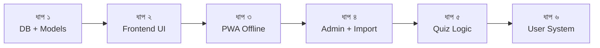

# 🧒 জিনিয়াস কিডস কুইজ গাইডবুক অ্যাপ — রোডম্যাপ

> **সর্বশেষ আপডেট:** ২৮ ফেব্রুয়ারি ২০২৬

## প্রজেক্ট তথ্য

| Item | Details |
|---|---|
| **প্রজেক্ট** | PwaPractice (Laravel PWA) |
| **উদ্দেশ্য** | জিনিয়াস কিডস কুইজ প্রতিযোগিতার গাইডবুককে অ্যাপে রূপান্তর |
| **মোট ক্যাটাগরি** | ৯টি |
| **মোট প্রশ্ন** | ~৯৮০টি |
| **প্রশ্নের ফরম্যাট** | প্রশ্ন + এক শব্দ/বাক্যে উত্তর (MCQ নয়) |
| **ডেটা সোর্স** | PDF/Doc ফাইল → Google Sheets/Excel → Laravel Import |
| **ডেপ্লয়মেন্ট** | GitHub → cPanel |

## বর্তমান অবস্থা

| Item | Status |
|---|---|
| Laravel Project | ✅ সেটআপ আছে |
| PWA (Service Worker, Manifest) | ✅ কাজ করছে, অ্যাপ ইন্সটল হয় |
| Bootstrap Template ("Kider") | ✅ ফ্রন্টএন্ড আছে |
| Database Models / Quiz Logic | ❌ নেই |
| Admin Panel | ❌ নেই |
| Authentication | ❌ নেই |

---

## 🗺️ রোডম্যাপ — ৬ টি ধাপ

### ধাপ ১: Database + Models + Sample Data
> **লক্ষ্য:** ডেটাবেস কাজ করে কিনা দেখা

**Database Structure:**
```
categories  → id, name, slug, icon, description, order
chapters    → id, category_id, name, slug, order
questions   → id, chapter_id, question_text, answer_text
```

> [!NOTE]
> প্রশ্ন ফরম্যাট শুধু "প্রশ্ন + উত্তর" — কোনো MCQ অপশন নেই।

**কাজ:**
- [ ] Migrations তৈরি (categories, chapters, questions)
- [ ] Models তৈরি + relationships (Category → Chapters → Questions)
- [ ] Seeder — ১০-২০টি sample প্রশ্ন দিয়ে

---

### ধাপ ২: Simple Frontend — CRUD → UI পাইপলাইন টেস্ট
> **লক্ষ্য:** ডেটা ফ্রন্টএন্ডে দেখানো হচ্ছে কিনা যাচাই

**কাজ:**
- [ ] হোম পেজ — Category কার্ড/তালিকা
- [ ] Chapter listing পেজ
- [ ] প্রশ্ন দেখানোর পেজ (ফ্ল্যাশকার্ড স্টাইল)
- [ ] মোবাইল-ফার্স্ট রেস্পন্সিভ ডিজাইন

---

### ধাপ ৩: PWA অফলাইন টেস্ট
> **লক্ষ্য:** অফলাইনে কুইজ ডেটা লোড হয় কিনা

**কাজ:**
- [ ] Service Worker — কুইজ ডেটা ক্যাশিং
- [ ] অফলাইনে ক্যাটাগরি ও প্রশ্ন দেখা যায় কিনা পরীক্ষা
- [ ] `manifest.json` আপডেট (জিনিয়াস কিডস ব্র্যান্ডিং)

---

### ধাপ ৪: Admin Panel + Data Import
> **লক্ষ্য:** আসল প্রশ্ন ইনপুট শুরু

**কাজ:**
- [ ] Admin authentication
- [ ] Category / Chapter / Question CRUD
- [ ] Excel/CSV Import ফিচার (৯৮০ প্রশ্ন দ্রুত ইনপুট)

**ডেটা ডিজিটাইজেশন প্রক্রিয়া:**
```
PDF/Doc → AI (structured format) → Google Sheets (verify) → CSV/XLSX → Laravel Import
```

---

### ধাপ ৫: কুইজ লজিক (Practice Mode)
> **লক্ষ্য:** ইউজার এক্সপেরিয়েন্স তৈরি

**কাজ:**
- [ ] ফ্ল্যাশকার্ড মোড (প্রশ্ন দেখাও → ক্লিক করলে উত্তর দেখাও)
- [ ] প্রগ্রেস বার
- [ ] "পড়েছি" মার্ক করার অপশন
- [ ] র‍্যান্ডম প্রশ্ন মোড

---

### ধাপ ৬: User System + Advanced Features
> **লক্ষ্য:** ফাইনাল ফিচারস

**কাজ:**
- [ ] User Registration/Login
- [ ] প্রগ্রেস ট্র্যাকিং ও হিস্ট্রি
- [ ] বুকমার্ক / পরে দেখবো
- [ ] ডেইলি চ্যালেঞ্জ
- [ ] লিডারবোর্ড ও শেয়ার ফিচার

---

## কাজের ক্রম



> [!IMPORTANT]
> প্রতিটি ধাপ শেষে PWA performance পরীক্ষা করা হবে — এটাই আমাদের incremental approach।
