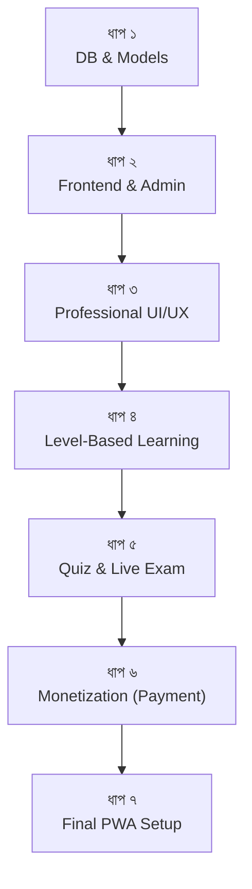

# 🧒 জিনিয়াস কিডস কুইজ গাইডবুক অ্যাপ — রোডম্যাপ

> **সর্বশেষ আপডেট:** 07 মার্চ 2026

## প্রজেক্ট তথ্য

| Item | Details |
|---|---|
| **প্রজেক্ট** | PwaPractice (Laravel PWA) |
| **উদ্দেশ্য** | জিনিয়াস কিডস কুইজ প্রতিযোগিতার গাইডবুককে অ্যাপে রূপান্তর |
| **মূল বিজনেস মডেল** | প্রিমিয়াম অ্যাপ (শিক্ষার্থীরা সামান্য পেমেন্ট করে ডাউনলোড/অ্যাক্সেস পাবে) |
| **মোট ক্যাটাগরি** | ৯টি |
| **মোট প্রশ্ন** | ~৯৮০টি |
| **লার্নিং মেথড** | লেভেল-ভিত্তিক পড়াশোনা ও কুইজ (অ্যাডাপ্টিভ লার্নিং) |
| **ডেটা সোর্স** | PDF/Doc ফাইল → Google Sheets/Excel → Laravel Import |
| **ডেপ্লয়মেন্ট** | GitHub → cPanel |

## বর্তমান অবস্থা

| Item | Status |
|---|---|
| Laravel Project | ✅ সেটআপ আছে |
| PWA (Service Worker, Manifest) | ✅ কাজ করছে, অ্যাপ ইন্সটল হয় |
| Bootstrap Template ("Kider") | ✅ ফ্রন্টএন্ড আছে |
| Database Models / Basic CRUD | ✅ প্রাথমিক কাজ শেষ |
| Admin Panel | ✅ প্রাথমিক ড্যাশবোর্ড ও রাউট আছে |
| Authentication | ✅ বেসিক লগিন/রেজিস্ট্রেশন আছে |
| Level System & Quiz Logic | ❌ নেই |
| Payment Integration | ❌ নেই |

---

## 🗺️ রোডম্যাপ — ৭ টি ধাপ

### ধাপ ১: Database + Models (Updated)
> **লক্ষ্য:** বেসিক এবং অ্যাডভান্সড ফাংশনালিটির জন্য ডেটাবেস প্রস্তুত করা

**Database Structure:**
```text
categories    → id, name, slug, icon, description, order
chapters      → id, category_id, name, slug, order
questions     → id, chapter_id, question_text, answer_text, level_id
levels        → id, name, required_score_to_unlock
user_progress → user_id, chapter_id/level_id, status (locked, active, completed)
quiz_attempts → user_id, level_id, score, passed
```

**কাজ:**
- [x] Migrations তৈরি (categories, chapters, questions)
- [x] Models তৈরি + relationships
- [ ] লেভেল (Levels) ও ইউজার প্রগ্রেস (User Progress) এর মাইগ্রেশন ও মডেল তৈরি
- [x] Seeder — স্যাম্পল প্রশ্ন দিয়ে

---

### ধাপ ২: Simple Frontend & Admin Panel
> **লক্ষ্য:** ডেটা ফ্রন্টএন্ডে ও অ্যাডমিন প্যানেলে ম্যানেজ করা

**কাজ:**
- [x] হোম পেজ — Category কার্ড/তালিকা
- [x] Chapter listing পেজ
- [x] Admin authentication & ড্যাশবোর্ড
- [x] Category / Chapter / Question CRUD
- [x] Excel/CSV Import ফিচার (৯৮০ প্রশ্ন দ্রুত ইনপুট)

---

### ধাপ ৩: Professional UI & UX
> **লক্ষ্য:** প্রিমিয়াম ইউজার এক্সপেরিয়েন্স তৈরি

**কাজ:**
- [x] ডেস্কটপ ভিউ: বামদিকে ফিক্সড ক্যাটাগরি সাইডবার
- [x] মোবাইল ভিউ: নিচে বটম নেভিগেশন বার বা হরাইজন্টাল স্লাইডার
- [x] UI Interaction Sound (বাটনে বা অ্যাকর্ডিয়নে ক্লিক করলে 'Pop' বা 'Click' সাউন্ড)

---

### ধাপ ৪: Level-based Learning System (লগিন আবশ্যক)
> **লক্ষ্য:** ইউজারদের ধাপে ধাপে শেখানো

**কাজ:**
- [ ] ইউজার রেজিস্ট্রেশন/লগিন বাধ্যতামূলক করা (পড়ার জন্য)
- [ ] লেভেল অনুসারে প্রশ্ন ভাগ করা (প্রথম লেভেল ফ্রি/অ্যাক্সেসযোগ্য, বাকিগুলো লক)
- [ ] ফ্ল্যাশকার্ড মোডে প্রশ্ন দেখানো (প্রশ্ন → ক্লিক → উত্তর)
- [ ] "পড়েছি" (Mark as Read) অপশন যুক্ত করা
- [ ] নির্দিষ্ট লেভেলের সব প্রশ্ন পড়া হলে কুইজ বাটন আনলক হবে

---

### ধাপ ৫: Quiz Logic & Live Exam 
> **লক্ষ্য:** কুইজ পাস করে লেভেল আনলক করা এবং লাইভ এক্সাম অংশ নেওয়া

**কাজ:**
- [ ] **লেভেল কুইজ:** পঠিত প্রশ্নগুলোর উপর কুইজ নেওয়া
- [ ] Quiz Feedback Sound (সঠিক উত্তরে 'Ting', ভুল হলে 'Buzzer')
- [ ] কুইজ পাশ করলে পরবর্তী লেভেল আনলক করা (Pass/Fail মেকানিজম)
- [ ] **লাইভ এক্সাম (Live Exam):** একটি নির্দিষ্ট সময়ে বা উইকেন্ডে সবার জন্য লাইভ প্রতিযোগিতা
- [ ] প্রগ্রেস ট্র্যাকিং ও হিস্ট্রি সংরক্ষণ

---

### ধাপ ৬: Monetization & Download Setup
> **লক্ষ্য:** অ্যাপ ডাউনলোড বা ফুল অ্যাক্সেসের জন্য পেমেন্ট গেটওয়ে যুক্ত করা

**কাজ:**
- [ ] পেমেন্ট গেটওয়ে ইন্টিগ্রেশন (aamarPay / bKash / SSLCommerz / Stripe ইত্যাদি)
- [ ] সামান্য পেমেন্ট করার পর অ্যাপ ডাউনলোড বা প্রিমিয়াম/ফুল অ্যাক্সেস আনলক করার লজিক
- [ ] Free Trial (প্রথম লেভেল) vs Premium User রোল সেটআপ

---

### ধাপ ৭: PWA Configuration & Final Deployment
> **লক্ষ্য:** অ্যাপ ডাউনলোড ও অফলাইন অ্যাক্সেস

**কাজ:**
- [x] Service Worker সেটআপ করা
- [ ] "Network Only" স্ট্র্যাটেজি থেকে সরে এসে প্রয়োজন অনুযায়ী ক্যাশ (Cache) করা
- [x] প্রফেশনাল Fallback অফলাইন পেজ তৈরি করা
- [ ] পেমেন্ট ভেরিফিকেশনের পর PWA ইন্সটল প্রম্পট (Add to Home Screen) দেখানো

---

## কাজের ক্রম


```mermaid
graph TD
    A["ধাপ ১<br>DB & Models"] --> B["ধাপ ২<br>Frontend & Admin"]
    B --> C["ধাপ ৩<br>Professional UI/UX"]
    C --> D["ধাপ ৪<br>Level-Based Learning"]
    D --> E["ধাপ ৫<br>Quiz & Live Exam"]
    E --> F["ধাপ ৬<br>Monetization (Payment)"]
    F --> G["ধাপ ৭<br>Final PWA Setup"]
```

> [!IMPORTANT]  
> পেমেন্ট মেকানিজম এবং লেভেল-লক ফিচারের জন্য ডাটাবেস কাঠামোতে কিছু বড় পরিবর্তন আনতে হবে। ধাপ ১ এর "Levels" এবং "User Progress" মডেলটি সবার আগে তৈরি করা প্রয়োজন।
